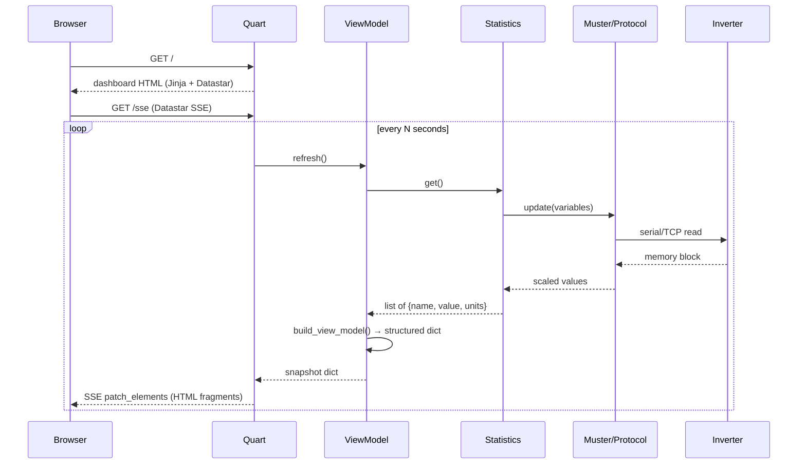

# Selpi — Agent Guide

> **Purpose:** This file tells AI agents how to work safely and effectively inside the Selpi repository.

---

## 1. Project Overview

Selpi is a **Python backend + Datastar UI frontend** for monitoring a **Selectronics SP Pro** inverter.

- **Backend:** Python (Quart ASGI server, `datastar-py` for SSE, Jinja2 templates)
- **Frontend:** Datastar (server-driven reactivity via SSE) + Datastar UI components
- **Protocol:** Custom serial/TCP protocol to read SP Pro memory-mapped variables
- **Reference implementation:** Decompiled source of Selectronic's official **SP LINK** Windows software lives in `SP LINK/`
- **Memory map:** `memorylayout.txt` contains extracted address constants from SP LINK

---

## 2. Architecture

```mermaid
flowchart LR
  Inverter[SP Pro Inverter] --> Protocol[memory.Protocol / Muster]
  Protocol --> Stats[statistics.Statistics]
  Stats --> VM[DashboardViewModel]
  VM --> Quart[Quart app]
  Quart --> HTML[Jinja + Datastar]
  Quart --> SSE[/sse stream]
  Browser --> Quart
```

### Key layers

| Layer | Location | Role |
|-------|----------|------|
| CLI entry | [`src/selpi.py`](src/selpi.py) | Dispatches `http`, `proxy`, `stat`, `dump` commands |
| HTTP server | [`src/commands/http.py`](src/commands/http.py) | Launches Quart/Hypercorn |
| Web app | [`src/web/app.py`](src/web/app.py) | Quart factory, registers blueprints |
| Routes | [`src/web/routes.py`](src/web/routes.py) | `/`, `/sse`, `/api/stats`, static assets |
| View model | [`src/web/viewmodel.py`](src/web/viewmodel.py) | Wraps `Statistics`, builds dashboard snapshot |
| Formatting | [`src/web/formatting.py`](src/web/formatting.py) | Maps raw stats → UI values, colors, derived metrics |
| Templates | [`src/web/templates/`](src/web/templates/) | Jinja2 HTML with Datastar attributes |
| Protocol | [`src/memory/`](src/memory/) | Serial/TCP login, CRC, request/response framing |
| Variables | [`src/memory/variable.py`](src/memory/variable.py) | Memory map: name → address, type, conversion |
| Statistics | [`src/statistics.py`](src/statistics.py) | Groups variables, applies scales, returns list of stats |
| SP LINK ref | [`SP LINK/`](SP LINK/) | Decompiled C# reference — **read-only** |

---

## 3. The Tao of Datastar

This project follows [The Tao of Datastar](https://data-star.dev/guide/the_tao_of_datastar).

### Core principles

1. **Server owns presentation data** — format numbers, map enums, compute colors/derived metrics in Python.
2. **Datastar owns reactivity** — SSE pushes signals or HTML fragments; minimal custom JS.
3. **Single process** — Quart serves HTML, static assets, JSON, and SSE.
4. **Pi-friendly** — no Node build step; Datastar loaded from CDN or vendored static.
5. **Keep protocol code untouched** — only wrap/adapt the HTTP layer.

### Datastar patterns used in this project

- **`data-signals`** — initial state on `<body>` (e.g. `{"tab": "overview"}`)
- **`data-on:load`** — auto-connect SSE on page load (`@get('/sse')`)
- **`data-class:active`** — conditional CSS classes (tab buttons)
- **`data-on:click`** — signal mutations (tab switching)
- **`data-show`** — conditional element visibility (tab panels)
- **SSE `patch_elements`** — server renders Jinja partials, pushes morph patches to `#id` selectors

### What NOT to do

- Do **not** add a Node.js build step, bundler, or npm dependencies.
- Do **not** move presentation logic into the browser (keep it in `formatting.py` / view model).
- Do **not** replace Datastar SSE with polling or WebSocket abstractions.
- Do **not** modify files inside `SP LINK/` — they are decompiled reference only.

---

## 4. Inverter Protocol & Memory Map

### How it works

1. **Login:** MD5 challenge-response using `SELPI_SPPRO_PASSWORD`.
2. **Read:** Send `Q` request with address + word count; SP Pro returns memory block.
3. **Scales:** Some variables are raw integers that need scaling factors (volts, current, temp). Scales are read opportunistically.

### Key files

- [`src/memory/protocol.py`](src/memory/protocol.py) — login, query, write, CRC
- [`src/memory/variable.py`](src/memory/variable.py) — `MAP` dict: name → address, type, conversion
- [`src/memory/converter.py`](src/memory/converter.py) — applies scale factors to raw values
- [`src/memory/request.py`](src/memory/request.py) — builds `Q`/`W` frames
- [`src/memory/response.py`](src/memory/response.py) — parses response frames
- [`src/memory/crc.py`](src/memory/crc.py) — CRC-16 calculation
- [`memorylayout.txt`](memorylayout.txt) — extracted address constants from SP LINK decompilation

### SP LINK reference

The `SP LINK/` directory contains decompiled C# source from Selectronic's official Windows software (version 15.0.8139.29909). Use it to:

- Cross-reference memory addresses and variable names
- Understand enum mappings (generator status, alarm codes, charge states)
- Verify scale factors and conversion formulas

**Do not edit SP LINK files.** They are read-only reference.

---

## 5. Data Flow



---

## 6. Frontend Structure

### Templates

| File | Purpose |
|------|---------|
| [`base.html`](src/web/templates/base.html) | HTML shell, loads Datastar from CDN, app CSS |
| [`dashboard.html`](src/web/templates/dashboard.html) | Tab layout, includes all partials |
| [`partials/header.html`](src/web/templates/partials/header.html) | Title, connection status, last updated |
| [`partials/alarm_banner.html`](src/web/templates/partials/alarm_banner.html) | Sticky alarm strip (shown when `alarms.any`) |
| [`partials/overview.html`](src/web/templates/partials/overview.html) | SOC, hours, solar, load, battery, charge state |
| [`partials/battery.html`](src/web/templates/partials/battery.html) | Volts, SOC, power, temp, kWh today/yesterday |
| [`partials/solar.html`](src/web/templates/partials/solar.html) | Solar power and % output |
| [`partials/load.html`](src/web/templates/partials/load.html) | Load power and today's kWh |
| [`partials/generator.html`](src/web/templates/partials/generator.html) | Status, reasons, AC in today/yesterday |
| [`partials/temperatures.html`](src/web/templates/partials/temperatures.html) | Battery, inlet, board, heatsink, transformer, fan |
| [`partials/alarms.html`](src/web/templates/partials/alarms.html) | Full alarm list with active/inactive styling |

### CSS

- [`src/web/static/css/app.css`](src/web/static/css/app.css) — dark theme, grid cards, tabs, alarm banner
- No CSS framework; custom CSS only

### Static assets

- [`src/web/static/alert.mp3`](src/web/static/alert.mp3) — alarm audio (moved from `pwa-archive/`)

---

## 7. Configuration

Environment variables are loaded from `src/.env.local` (copy from `src/.env.dist`).

### Connection

| Variable | Default | Purpose |
|----------|---------|---------|
| `SELPI_CONNECTION_TYPE` | `Serial` | `Serial`, `SelectLive`, or `TCP` |
| `SELPI_CONNECTION_SERIAL_PORT` | `/dev/ttyUSB0` | FTDI USB serial port |
| `SELPI_CONNECTION_SERIAL_BAUDRATE` | `57600` | Serial baud rate |
| `SELPI_CONNECTION_TCP_HOSTNAME` | `127.0.0.1` | TCP target host |
| `SELPI_CONNECTION_TCP_PORT` | `1234` | TCP target port |
| `SELPI_SPPRO_PASSWORD` | `Selectronic SP PRO` | Inverter login password |

### HTTP Server

| Variable | Default | Purpose |
|----------|---------|---------|
| `SELPI_HTTP_HOST` | `0.0.0.0` | Bind address |
| `SELPI_HTTP_PORT` | `8000` | Bind port |
| `SELPI_HTTP_USERNAME` | `selpi` | Basic auth username |
| `SELPI_HTTP_PASSWORD` | `selpi` | Basic auth password |
| `SELPI_HTTP_REFRESH_SECONDS` | `5` | SSE poll interval |

### Dashboard

| Variable | Default | Purpose |
|----------|---------|---------|
| `SELPI_BATTERY_SIZE_WH` | `17000` | Battery capacity for hours-remaining calc |
| `SELPI_SHUTDOWN_PERCENT` | `10` | Shutdown SOC threshold |

---

## 8. Development Workflow

### Setup

```bash
cp src/.env.dist src/.env.local
# edit src/.env.local as needed
cd src
uv sync
uv run selpi.py http
```

Open `http://<pi-ip>:8000`.

### Running tests

```bash
cd src
uv run pytest
```

### Key conventions

- **Python path:** Run commands from `src/` so `from muster import Muster` style imports work.
- **Async:** Quart is async; `Statistics.get()` is blocking — use `asyncio.to_thread()` if calling from async context.
- **SSE serialization:** Only one `Statistics.get()` call per refresh tick; broadcast snapshot to all subscribers.
- **Error handling:** On read error, keep last good values and set `meta.error` / `meta.connected = False`.

---

## 9. Adding New Variables

When the SP LINK reference reveals a new memory address:

1. Add entry to `MAP` in [`src/memory/variable.py`](src/memory/variable.py) with `ADDRESS`, `TYPE`, `DESCRIPTION`, `UNITS`, `CONVERSION`.
2. Add `variable.create('Name')` to the appropriate list in [`src/statistics.py`](src/statistics.py).
3. If it needs derived formatting, add logic in [`src/web/formatting.py`](src/web/formatting.py) `build_view_model()`.
4. Add a template partial or extend an existing one in [`src/web/templates/partials/`](src/web/templates/partials/).
5. Add the partial to the SSE stream in [`src/web/routes.py`](src/web/routes.py) if it needs live updates.

---

## 10. Deployment

### Docker

- [`Dockerfile`](Dockerfile) — builds with `uv sync`, runs `selpi.py http`
- [`docker-compose.yml`](docker-compose.yml) — single service on `:8000`
- [`release.sh`](release.sh) — build + deploy script

### nginx

- Proxies `/`, `/sse`, `/static/` to Quart on `:8000`
- SSE requires `proxy_buffering off;` and suitable timeouts

---

## 11. Reference: SP LINK Source

The `SP LINK/` directory contains decompiled C# from `SP LINK.exe` v15.0.8139.29909.

### Useful files for protocol work

| File | What it contains |
|------|------------------|
| [`mGLOBALS.cs`](SP LINK/mGLOBALS.cs) | Global constants, memory address enums, model descriptions |
| [`mDataConvert.cs`](SP LINK/mDataConvert.cs) | All display formatting, enum→string maps, color logic |
| [`mDataDisplay.cs`](SP LINK/mDataDisplay.cs) | UI update logic for every tab |
| [`mConfig.cs`](SP LINK/mConfig.cs) | Configuration read/write, validation |
| [`mServiceTab.cs`](SP LINK/mServiceTab.cs) | Service tab, date/time, firmware info |
| [`mQuickView.cs`](SP LINK/mQuickView.cs) | Quick view tab logic |
| [`mMultiPhase.cs`](SP LINK/mMultiPhase.cs) | Multi-phase / Powerchain support |
| [`mSelectLive.cs`](SP LINK/mSelectLive.cs) | SelectLive remote connection protocol |
| [`mEncryption.cs`](SP LINK/mEncryption.cs) | Login / encryption helpers |
| [`mRawDataDownload.cs`](SP LINK/mRawDataDownload.cs) | CSV export, logged data download |
| [`fclsFirmwareUpdate.cs`](SP LINK/fclsFirmwareUpdate.cs) | Firmware update procedure |
| [`DefaultSettingsTemplate.cs`](SP LINK/DefaultSettingsTemplate.cs) | Default config values |
| [`memorylayout.txt`](memorylayout.txt) | Extracted address constants (auto-generated from SP LINK) |

---

## 12. Important Notes

- **Do not modify `SP LINK/`** — it is decompiled reference code, not part of the build.
- **Do not add Node.js tooling** — the project explicitly avoids npm/yarn.
- **Keep protocol code stable** — `src/memory/` and `src/muster.py` are mature; changes there need hardware to test.
- **Datastar UI components** — if Datastar UI requires a build step, fall back to Datastar core + custom CSS.
- **Serial bus contention** — only one `Statistics.get()` per tick; use a shared refresher task if multiple SSE clients connect.

---

## 13. Quick Reference: Current Stats Tracked

From [`src/statistics.py`](src/statistics.py):

- `CombinedKacoAcPowerHiRes` — AC Solar Power (W)
- `LoadAcPower` — AC Load Power (W)
- `ACLoadkWhTotalAcc` — AC Lifetime Load Energy (Wh)
- `BatteryVolts` — Battery Volts (V)
- `DCBatteryPower` — Battery Power (W)
- `Shunt1Power` / `Shunt2Power` — Shunt powers (W)
- `Heatsink1Temp` / `Heatsink2Temp` — Heatsink temps (°C)
- `ControlBoardTemp` — Control board temp (°C)
- `BatteryTemperature` — Battery temp (°C)
- `TransformerTemp` — Transformer temp (°C)
- `InletTemp` — Inlet temp (°C)
- `FanSpeed` — Fan RPM
- `BattOutToday` / `BattInToday` / `BattNetToday` — Battery energy today (Wh)
- `BattInYesterday` / `BattOutYesterday` — Battery energy yesterday (Wh)
- `absorb` / `bulk` / `float` — Charge state flags
- `BattSocPercent` — State of Charge (%)
- `LoadAccumulatedToday` — Load energy today (Wh)
- `PercentageSolarOutput` — Solar % output
- `GeneratorStartReason` / `GeneratorRunningReason` / `GeneratorStatus` — Generator state
- `ACInputToday` / `ACInputYesterday` — AC input energy (Wh)
- `FloatHours` — Float hours
- `GeneratorRed` / `OverTempRed` / `ServiceRequiredRed` / `ShutdownRed` — Alarm flags
- `ACInputDuskToday` / `ACInputDuskYesterday` / `DuskDaysToRecharge` — Dusk metrics

---

## 14. Migration Context

This project recently migrated from a Quasar/Node PWA (`pwa-archive/`) to the current Datastar stack. The old frontend is archived for reference only. See [`plans/datastar-frontend-migration.md`](plans/datastar-frontend-migration.md) for the full migration plan.
