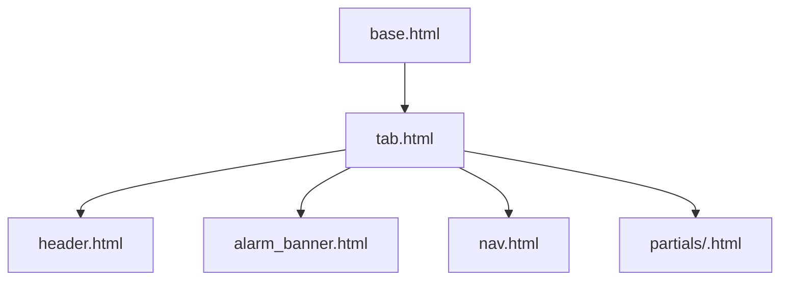
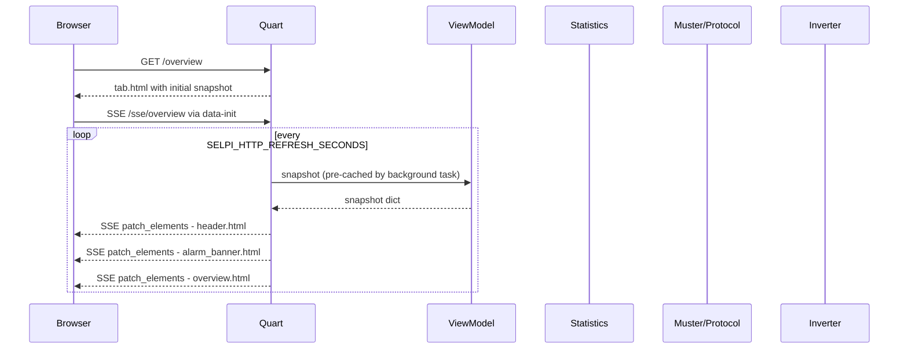

# Selpi — Agent Guide

> **Purpose:** This file tells AI agents how to work safely and effectively inside the Selpi repository.

---

## 1. Project Overview

Selpi is a **Python backend + Datastar UI frontend** for monitoring a **Selectronics SP Pro** inverter in an **AC-coupled** household solar configuration. It reads real-time telemetry from the inverter over a serial/TCP protocol and presents a live web dashboard.

- **Backend:** Python (Quart ASGI server, `datastar-py` for SSE, Jinja2 templates)
- **Frontend:** Datastar (server-driven reactivity via SSE) — no build step, no npm
- **Protocol:** Custom serial/TCP protocol to read SP Pro memory-mapped variables
- **Charts:** uPlot (loaded from CDN) for historical time-series — the one exception to "minimal client JS"
- **History:** SQLite-backed time-series storage for graphing past telemetry
- **Configuration:** All settings via environment variables (`.env.local` / `.env.dist`)
- **Reference implementation:** Decompiled source of Selectronic's official **SP LINK** Windows software lives in `SP LINK/`
- **Memory map:** `memorylayout.txt` contains extracted address constants from SP LINK

---

## 2. Architecture

```mermaid
flowchart LR
  Inverter[SP Pro Inverter] --> Protocol[memory.Protocol / Muster]
  Protocol --> Stats[statistics.Statistics]
  Stats --> VM[DashboardViewModel]
  VM --> Quart[Quart app]
  Quart --> HTML[Jinja + Datastar]
  Quart --> SSE[/sse/tab-name]
  Quart --> API[/api/history, /api/stats]
  Browser --> Quart
  HistoryStore[SQLite HistoryStore] --> Quart
```

### Key layers

| Layer | Location | Role |
|-------|----------|------|
| CLI entry | [`src/selpi.py`](src/selpi.py) | Dispatches `http`, `proxy`, `stat`, `dump` commands |
| HTTP server | [`src/commands/http.py`](src/commands/http.py) | Launches Quart/Hypercorn |
| Web app | [`src/web/app.py`](src/web/app.py) | Quart factory, background refresh task, registers blueprint |
| Routes | [`src/web/routes.py`](src/web/routes.py) | Per-tab pages, per-tab SSE, JSON APIs, generator control |
| View model | [`src/web/viewmodel.py`](src/web/viewmodel.py) | Wraps `Statistics`, builds dashboard snapshot dict |
| Formatting | [`src/web/formatting.py`](src/web/formatting.py) | Maps raw stats → UI values, colors, derived metrics, enums |
| History | [`src/history.py`](src/history.py) | SQLite time-series store with raw/hourly/daily tiers |
| Templates | [`src/web/templates/`](src/web/templates/) | Jinja2 HTML with Datastar attributes |
| Protocol | [`src/memory/`](src/memory/) | Serial/TCP login, CRC, request/response framing |
| Variables | [`src/memory/variable.py`](src/memory/variable.py) | Memory map: name → address, type, conversion |
| Statistics | [`src/statistics.py`](src/statistics.py) | Groups variables, applies scales, returns list of stats |
| Connection | [`src/connection/`](src/connection/) | Serial, TCP, SelectLive connection adapters |
| SP LINK ref | `SP LINK/` | Decompiled C# reference — **read-only** |

---

## 3. The Tao of Datastar

This project follows [The Tao of Datastar](https://data-star.dev/guide/the_tao_of_datastar).

### Core principles

1. **Server owns presentation data** — format numbers, map enums, compute colors/derived metrics in Python.
2. **Datastar owns reactivity** — SSE pushes HTML fragments; minimal custom JS.
3. **Single process** — Quart serves HTML, static assets, JSON, and SSE.
4. **Pi-friendly** — no Node build step; Datastar loaded from CDN.
5. **Keep protocol code untouched** — only wrap/adapt the HTTP layer.

### Datastar reference

When you need to understand Datastar, consult these resources:

- **Getting started guide:** [Datastar Getting Started](https://data-star.dev/guide/getting_started) — overview of Datastar concepts and how to use it
- **Attributes reference:** [Datastar Attributes Reference](https://data-star.dev/reference/attributes) — complete reference for all Datastar HTML attributes
- **Python SDK:** [`datastar-py` README](https://github.com/starfederation/datastar-python/blob/develop/README.md) — provides `ServerSentEventGenerator`, `DatastarResponse`, and the `@datastar_response` decorator for Quart

### Datastar patterns used in this project

- **`data-init`** — auto-connect SSE on element load (`data-init="@get('/sse/overview')"`)
- **`patch_elements` (SSE)** — server renders Jinja partials, pushes DOM patches to `#id` selectors
- **`consts.ElementPatchMode.INNER`** — replaces innerHTML of the target element

### What NOT to do

- Do **not** add a Node.js build step, bundler, or npm dependencies.
- Do **not** move presentation logic into the browser (keep it in [`src/web/formatting.py`](src/web/formatting.py) / view model).
- Do **not** replace Datastar SSE with polling or WebSocket abstractions.
- Do **not** modify files inside `SP LINK/` — they are decompiled reference only.
- Do **not** use client-side routing — navigation is server-rendered `<a href>` links.

---

## 4. Routing & Tab Architecture

### Per-tab URLs

Each dashboard tab has its own URL and page load. This is **not** a single-page app.

| URL | Tab | Has SSE | Description |
|-----|-----|---------|-------------|
| `/` | — | — | Redirects to `/overview` |
| `/overview` | overview | ✅ | Energy flow + key metrics |
| `/battery` | battery | ✅ | Battery voltage, SOC, power, temps |
| `/solar` | solar | ✅ | Solar inverter power and % output |
| `/load` | load | ✅ | Household load power |
| `/generator` | generator | ✅ | Generator status, start/stop controls |
| `/temperatures` | temperatures | ✅ | All temperature readings + fan |
| `/history` | history | ✅ | DC/AC historical accumulators |
| `/charts` | charts | ❌ | uPlot charts via `/api/history` (client-side fetch) |
| `/extra` | extra | ✅ | Technical data: regulation, I/O, unit info |
| `/alarms` | alarms | ✅ | Full alarm/event list |

### SSE endpoint

Each tab connects to `/sse/<tab_name>`. The SSE handler in [`src/web/routes.py`](src/web/routes.py) pushes three patches per tick:

1. `#header-meta` — connection status, last updated (shared across all tabs)
2. `#alarm-banner` — sticky alarm strip (shared)
3. `#tab-content` — the tab-specific partial content

### Template structure



| File | Purpose |
|------|---------|
| [`base.html`](src/web/templates/base.html) | HTML shell, loads Datastar from CDN, uPlot from CDN, app CSS |
| [`tab.html`](src/web/templates/tab.html) | Generic tab layout, `data-init` for SSE, includes all partials |
| [`partials/header.html`](src/web/templates/partials/header.html) | Connection status, last updated timestamp |
| [`partials/alarm_banner.html`](src/web/templates/partials/alarm_banner.html) | Sticky alarm strip (shown when `alarms.any`) |
| [`partials/nav.html`](src/web/templates/partials/nav.html) | Tab navigation bar (server-rendered `<a>` links) |
| [`partials/overview.html`](src/web/templates/partials/overview.html) | Energy flow diagram (AC-coupled visualization) |
| [`partials/battery.html`](src/web/templates/partials/battery.html) | Battery metrics cards |
| [`partials/solar.html`](src/web/templates/partials/solar.html) | Solar inverter power and % output |
| [`partials/load.html`](src/web/templates/partials/load.html) | Load power and today's kWh |
| [`partials/generator.html`](src/web/templates/partials/generator.html) | Generator status, start/stop controls |
| [`partials/temperatures.html`](src/web/templates/partials/temperatures.html) | All temperature readings + fan speed |
| [`partials/history.html`](src/web/templates/partials/history.html) | DC/AC historical energy accumulators |
| [`partials/charts.html`](src/web/templates/partials/charts.html) | uPlot chart containers (populated by `charts.js`) |
| [`partials/extra.html`](src/web/templates/partials/extra.html) | Technical data: regulation, battery tech, I/O, unit ID |
| [`partials/alarms.html`](src/web/templates/partials/alarms.html) | Full alarm list with active/inactive styling |
| [`partials/energy_flow.html`](src/web/templates/partials/energy_flow.html) | SVG-based animated energy flow diagram |

### Static assets

| File | Purpose |
|------|---------|
| [`src/web/static/css/app.css`](src/web/static/css/app.css) | Dark theme, grid cards, tabs, energy flow, alarm banner |
| [`src/web/static/js/charts.js`](src/web/static/js/charts.js) | uPlot chart rendering, fetches from `/api/history` |
| [`src/web/static/alert.mp3`](src/web/static/alert.mp3) | Alarm audio |
| [`src/web/static/img/selectronic-logo.svg`](src/web/static/img/selectronic-logo.svg) | Selectronic logo for energy flow |
| [`src/web/static/img/abb-logo.svg`](src/web/static/img/abb-logo.svg) | ABB logo for solar inverter |

---

## 5. Inverter Protocol & Memory Map

### How it works

1. **Login:** MD5 challenge-response using `SELPI_SPPRO_PASSWORD` (see [`src/memory/protocol.py`](src/memory/protocol.py))
2. **Read:** Send query request with address + word count; SP Pro returns memory block
3. **Scales:** Some variables are raw integers that need scaling factors (volts, current, temp). Scales are read opportunistically alongside normal variable reads
4. **Write:** Used for generator control (`GeneratorBtnPressPort1`) — simulates front-panel button presses

### Connection types

Configured via `SELPI_CONNECTION_TYPE`:

| Type | Adapter | Notes |
|------|---------|-------|
| `Serial` | [`src/connection/connection_serial.py`](src/connection/connection_serial.py) | FTDI USB serial, default for direct connection |
| `TCP` | [`src/connection/connection_tcp.py`](src/connection/connection_tcp.py) | TCP socket, used with proxy or serial-to-TCP adapter |
| `SelectLive` | [`src/connection/connection_select_live.py`](src/connection/connection_select_live.py) | Selectronic's cloud service for remote monitoring |

### Key files

- [`src/memory/protocol.py`](src/memory/protocol.py) — login, query, write, CRC
- [`src/memory/variable.py`](src/memory/variable.py) — `MAP` dict: name → address, type, conversion
- [`src/memory/converter.py`](src/memory/converter.py) — applies scale factors to raw values
- [`src/memory/request.py`](src/memory/request.py) — builds query/write frames
- [`src/memory/response.py`](src/memory/response.py) — parses response frames
- [`src/memory/crc.py`](src/memory/crc.py) — CRC-16 calculation
- [`memorylayout.txt`](memorylayout.txt) — extracted address constants from SP LINK decompilation

### SP LINK reference

The `SP LINK/` directory contains decompiled C# source from Selectronic's official Windows software (version 15.0.8139.29909). Use it to:

- Cross-reference memory addresses and variable names
- Understand enum mappings (generator status, alarm codes, charge states)
- Verify scale factors and conversion formulas

**Do not edit SP LINK files.** They are read-only reference.

---

## 6. Data Flow

### SSE refresh cycle



### Background refresh

The actual inverter polling happens in a background task started by [`src/web/app.py`](src/web/app.py):

1. [`_background_refresh()`](src/web/app.py:17) calls `view_model.refresh_async()` every `SELPI_HTTP_REFRESH_SECONDS`
2. [`DashboardViewModel.refresh()`](src/web/viewmodel.py:34) calls `Statistics.get()` (blocking, runs in thread pool)
3. [`Statistics.get()`](src/statistics.py:311) calls `Muster.update()` to read variables from the inverter
4. The snapshot is stored in `view_model.snapshot` and served to all SSE clients
5. [`_background_history_cleanup()`](src/web/app.py:27) runs daily to aggregate/prune SQLite history

### HistoryStore

[`src/history.py`](src/history.py) records a subset of metrics to SQLite with three resolution tiers:

| Tier | Resolution | Retention |
|------|-----------|-----------|
| Raw | Every poll (~5s) | `SELPI_HISTORY_RAW_DAYS` (default 7 days) |
| Hourly | 1-hour averages | `SELPI_HISTORY_HOURLY_DAYS` (default 90 days) |
| Daily | 1-day averages | Indefinite |

The `/api/history/<variable>?range=<range>` endpoint auto-selects the appropriate tier. The charts tab uses this API client-side via [`src/web/static/js/charts.js`](src/web/static/js/charts.js).

---

## 7. Energy Flow Diagram

The overview tab displays an animated SVG energy flow diagram ([`partials/energy_flow.html`](src/web/templates/partials/energy_flow.html)) showing power flow between:

- **Solar Inverter** (ABB/string inverter) → AC bus
- **Generator** → AC bus
- **AC bus** → **House** (load)
- **SP PRO** ↔ AC bus (battery charging/discharging)
- **Battery** (visual SOC indicator with charge bolt)

Flow animation speed is proportional to power magnitude. Colors indicate active/inactive states and flow direction. The `flow` dict in the snapshot (built by [`src/web/formatting.py`](src/web/formatting.py)) drives all the template logic.

---

## 8. Configuration

Environment variables are loaded from `src/.env.local` (copy from `src/.env.dist`).

### Connection

| Variable | Default | Purpose |
|----------|---------|---------|
| `SELPI_CONNECTION_TYPE` | `Serial` | `Serial`, `SelectLive`, or `TCP` |
| `SELPI_CONNECTION_SERIAL_PORT` | `/dev/ttyUSB0` | FTDI USB serial port |
| `SELPI_CONNECTION_SERIAL_BAUDRATE` | `57600` | Serial baud rate |
| `SELPI_CONNECTION_TCP_HOSTNAME` | `127.0.0.1` | TCP target host |
| `SELPI_CONNECTION_TCP_PORT` | `1234` | TCP target port |
| `SELPI_SPPRO_PASSWORD` | `Selectronic SP PRO` | Inverter login password |

### HTTP Server

| Variable | Default | Purpose |
|----------|---------|---------|
| `SELPI_HTTP_HOST` | `0.0.0.0` | Bind address |
| `SELPI_HTTP_PORT` | `8000` | Bind port |
| `SELPI_HTTP_USERNAME` | `selpi` | Basic auth username |
| `SELPI_HTTP_PASSWORD` | `selpi` | Basic auth password |
| `SELPI_HTTP_REFRESH_SECONDS` | `5` | SSE poll interval |

### Dashboard

| Variable | Default | Purpose |
|----------|---------|---------|
| `SELPI_BATTERY_SIZE_WH` | `17000` | Battery capacity for hours-remaining calc |
| `SELPI_SHUTDOWN_PERCENT` | `10` | Shutdown SOC threshold |

### History (SQLite)

| Variable | Default | Purpose |
|----------|---------|---------|
| `SELPI_HISTORY_DB_PATH` | `selpi-history.db` | SQLite database file path |
| `SELPI_HISTORY_RAW_DAYS` | `7` | Days to retain raw readings |
| `SELPI_HISTORY_HOURLY_DAYS` | `90` | Days to retain hourly aggregates |

---

## 9. API Endpoints

| Method | Path | Purpose |
|--------|------|---------|
| GET | `/` | Redirect to `/overview` |
| GET | `/<tab_name>` | Render tab page with initial snapshot |
| GET | `/sse/<tab_name>` | SSE stream for live tab updates |
| GET | `/api/stats` | JSON snapshot of all current stats |
| GET | `/api/history/<variable>` | JSON time-series data (`?range=1h\|6h\|24h\|7d\|30d\|1y`) |
| GET | `/api/history/variables` | JSON list of tracked metric names |
| POST | `/api/generator/start` | Start generator (short press simulation) |
| POST | `/api/generator/stop` | Stop generator (long press simulation) |
| GET | `/health` | Returns `"ok"` for health checks |
| GET | `/preview/energy-flow` | Mock-data energy flow for visual dev |

---

## 10. Development Workflow

### Setup

```bash
cp src/.env.dist src/.env.local
# edit src/.env.local as needed
cd src
uv sync
uv run selpi.py http
```

Open `http://localhost:8000`.

### Preview mode (no hardware)

For visual development of templates without an inverter connection:

```bash
cd src
uv run python preview.py
```

Open `http://localhost:8000/preview/energy-flow` to see the energy flow diagram with mock data.

### Running tests

> **Do not run tests.** Agents should not execute `pytest` or any test suite. Tests are run by the developer outside the agent workflow.

```bash
cd src
uv run pytest
```

### Key conventions

- **Python path:** Run commands from `src/` so `from muster import Muster` style imports work.
- **Async:** Quart is async; `Statistics.get()` is blocking — use `asyncio.to_thread()` if calling from async context.
- **SSE serialization:** Only one `Statistics.get()` call per refresh tick; broadcast snapshot to all subscribers.
- **Error handling:** On read error, keep last good values and set `meta.error` / `meta.connected = False`.
- **Snapshot structure:** The view model snapshot is a nested dict with keys: `meta`, `overview`, `battery`, `solar`, `load`, `generator`, `temperatures`, `alarms`, `attention`, `history`, `extra`, `flow`.

---

## 11. Adding New Variables

When the SP LINK reference reveals a new memory address:

1. Add entry to `MAP` in [`src/memory/variable.py`](src/memory/variable.py) with `ADDRESS`, `TYPE`, `DESCRIPTION`, `UNITS`, `CONVERSION`.
2. Add `variable.create('Name')` to the appropriate list in [`src/statistics.py`](src/statistics.py).
3. If it needs derived formatting, add logic in [`src/web/formatting.py`](src/web/formatting.py) `build_view_model()`.
4. Add a template partial or extend an existing one in [`src/web/templates/partials/`](src/web/templates/partials/).
5. Add the partial to the SSE stream in [`src/web/routes.py`](src/web/routes.py) if it needs live updates.
6. If it should be graphed, add to `TRACKED_METRICS` in [`src/history.py`](src/history.py).

---

## 12. Deployment

### Docker

- [`Dockerfile`](Dockerfile) — builds with `uv sync`, runs `selpi.py http`
- [`docker-compose.yml`](docker-compose.yml) — single service on `:8000`, mounts `/dev/ttyUSB0` and data volume
- [`release.sh`](release.sh) — build + deploy script

### nginx

- Proxies `/`, `/sse/`, `/static/` to Quart on `:8000`
- SSE requires `proxy_buffering off;` and suitable timeouts

---

## 13. Reference: SP LINK Source

The `SP LINK/` directory contains decompiled C# from `SP LINK.exe` v15.0.8139.29909.

### Useful files for protocol work

| File | What it contains |
|------|------------------|
| `mGLOBALS.cs` | Global constants, memory address enums, model descriptions |
| `mDataConvert.cs` | All display formatting, enum→string maps, color logic |
| `mDataDisplay.cs` | UI update logic for every tab |
| `mConfig.cs` | Configuration read/write, validation |
| `mServiceTab.cs` | Service tab, date/time, firmware info |
| `mQuickView.cs` | Quick view tab logic |
| `mMultiPhase.cs` | Multi-phase / Powerchain support |
| `mSelectLive.cs` | SelectLive remote connection protocol |
| `mEncryption.cs` | Login / encryption helpers |
| `mRawDataDownload.cs` | CSV export, logged data download |
| `fclsFirmwareUpdate.cs` | Firmware update procedure |
| `DefaultSettingsTemplate.cs` | Default config values |
| [`memorylayout.txt`](memorylayout.txt) | Extracted address constants (auto-generated from SP LINK) |

---

## 14. Important Notes

- **Do not modify `SP LINK/`** — it is decompiled reference code, not part of the build.
- **Do not add Node.js tooling** — the project explicitly avoids npm/yarn.
- **Keep protocol code stable** — `src/memory/` and `src/muster.py` are mature; changes there need hardware to test.
- **Datastar UI components** — if Datastar UI requires a build step, fall back to Datastar core + custom CSS.
- **Serial bus contention** — only one `Statistics.get()` per tick; the background refresh task serializes access.
- **Charts tab is the exception** — it uses client-side JS ([`charts.js`](src/web/static/js/charts.js)) with uPlot to fetch and render historical data. This is acceptable because charts require client-side interactivity (zoom, pan, range selection).
- **Generator control writes** — POST endpoints write directly to inverter memory. Ensure safety checks (already-running status) before writing.

---

## 15. Quick Reference: Current Stats Tracked

From [`src/statistics.py`](src/statistics.py):

### Power flows
- `CombinedKacoAcPowerHiRes` — AC Solar Power (W)
- `LoadAcPower` — AC Load Power (W)
- `DCBatteryPower` — Battery Power (W)
- `Shunt1Power` / `Shunt2Power` — Shunt powers (W)

### Battery
- `BatteryVolts` — Battery Volts (V)
- `BattSocPercent` — State of Charge (%)
- `BatteryTemperature` — Battery temp (°C)
- `BattOutToday` / `BattInToday` / `BattNetToday` — Battery energy today (Wh)
- `BattInYesterday` / `BattOutYesterday` — Battery energy yesterday (Wh)
- `absorb` / `bulk` / `float` — Charge state flags
- `FloatHours` — Float hours

### Solar & Load
- `PercentageSolarOutput` — Solar % output
- `LoadAccumulatedToday` — Load energy today (Wh)
- `ACLoadkWhTotalAcc` — AC Lifetime Load Energy (Wh)

### Generator
- `GeneratorStartReason` / `GeneratorRunningReason` / `GeneratorStatus` — Generator state
- `ACGeneratorPower` — Generator power (W)
- `ACInputToday` / `ACInputYesterday` — AC input energy (Wh)

### Temperatures
- `Heatsink1Temp` / `Heatsink2Temp` — Heatsink temps (°C)
- `ControlBoardTemp` — Control board temp (°C)
- `TransformerTemp` — Transformer temp (°C)
- `InletTemp` — Inlet temp (°C)
- `FanSpeed` — Fan RPM

### Alarms
- `GeneratorRed` / `OverTempRed` / `ServiceRequiredRed` / `ShutdownRed` — Alarm flags
- `ServiceRequiredReason0` through `ServiceRequiredReason19` — Alert event codes

### Derived (computed in formatting.py)
- `ACInputDuskToday` / `ACInputDuskYesterday` / `DuskDaysToRecharge` — Dusk metrics
- `hours_remaining` — Estimated hours until shutdown SOC
- Energy flow dict (`flow`) — powers the animated SVG diagram

---

## 16. Migration Context

This project migrated from a Quasar/Node PWA (`pwa-archive/`) to the current Datastar stack. The old frontend is archived for reference only. See [`plans/datastar-frontend-migration.md`](plans/datastar-frontend-migration.md) for the full migration plan.
