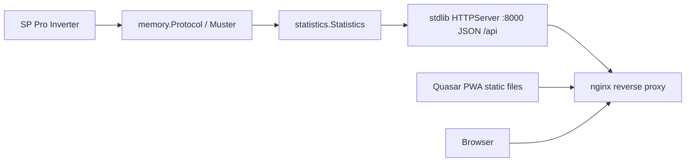
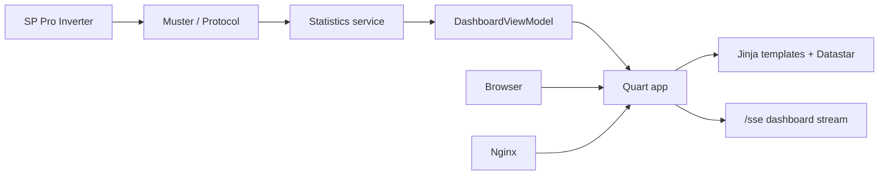
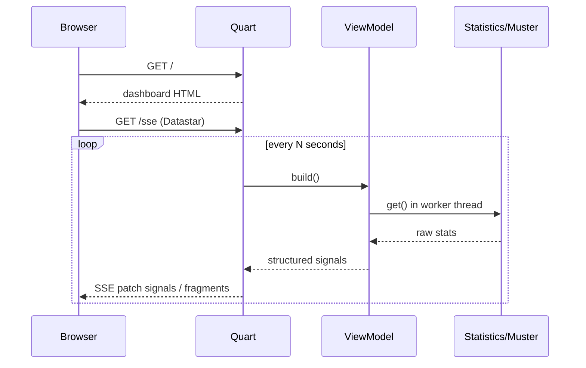

# Selpi Datastar Frontend Migration Plan

## Goal

Replace the Quasar/Node PWA with a **Python-served Datastar UI** using:

- **Quart** as the async HTTP server
- **datastar-py** for SSE / fragment updates
- **Datastar UI** (`https://datastar-ui.com/`) for tabs, cards, badges, alerts
- No Node build step

Keep the existing inverter protocol stack (`Muster`, `Statistics`, serial/SelectLive/TCP) intact.

---

## Current State



### What exists today

| Layer | Implementation |
|-------|----------------|
| Protocol | [`src/memory/`](src/memory/), [`src/muster.py`](src/muster.py) |
| Stats aggregation | [`src/statistics.py`](src/statistics.py) — returns list of `{name, description, value, units}` |
| HTTP | [`src/commands/http.py`](src/commands/http.py) — stdlib `HTTPServer`, JSON only on GET |
| Frontend | [`pwa/`](pwa/) Quasar v1 SPA, polls `/api/` every 30s |
| Deploy | nginx serves built PWA static files; Docker runs Python API on `:8000` ([`release.sh`](release.sh)) |

### Data currently shown (from [`pwa/src/pages/Index.vue`](pwa/src/pages/Index.vue))

- **Gauges:** SOC %, hours remaining, solar watts
- **Chips:** load W, battery power W, charge state, temps, today's usage, gen kWh, float hours, battery V, last updated
- **Alarms:** generator / over-temp / service / shutdown (with audio alert)

Derived client-side today (should move server-side):

- SOC color thresholds
- Hours remaining from battery size + SOC + discharge power
- Generator status/reason text maps
- Charge state (bulk/absorb/float)

---

## Target Architecture



### Design principles

1. **Server owns presentation data** — format numbers, map enums, compute colors/derived metrics in Python.
2. **Datastar owns reactivity** — SSE pushes signals or HTML fragments; minimal custom JS.
3. **Single process** — Quart serves HTML, static assets, JSON (optional), and SSE.
4. **Pi-friendly** — no Node toolchain; CDN or vendored Datastar + Datastar UI assets.
5. **Keep protocol code untouched** where possible; only wrap/adapt the HTTP layer.

---

## Proposed Project Layout

```text
src/
  selpi.py                 # CLI entry (keep)
  commands/
    http.py                # REPLACE: launch Quart app
    ...
  web/                     # NEW
    __init__.py
    app.py                 # Quart application factory
    routes.py              # page + SSE + optional JSON routes
    viewmodel.py           # map Statistics -> dashboard signals/sections
    formatting.py          # generator maps, units, colors, hours remaining
    templates/
      base.html
      dashboard.html
      partials/
        overview.html
        battery.html
        solar.html
        load.html
        generator.html
        temperatures.html
        alarms.html
        metric_card.html
    static/
      css/app.css          # dark theme polish / gauge styles
      js/                  # optional: only if Datastar UI needs local assets
      alert.mp3            # move from pwa/public
      icons/               # favicons from pwa if desired
  statistics.py            # keep; maybe small cleanups
  ...
pwa/                       # REMOVE after cutover (or archive)
```

---

## Backend Plan

### 1. Dependencies ([`src/pyproject.toml`](src/pyproject.toml))

Add:

- `quart`
- `datastar-py`
- `jinja2` (comes with Quart)
- optionally `hypercorn` if not pulled transitively (Quart’s ASGI server)

Keep: `pyserial`, `python-dotenv`.

### 2. Replace [`src/commands/http.py`](src/commands/http.py)

- `selpi.py http` starts Quart/Hypercorn on `:8000` (or configurable).
- Wire auth from existing env (`SELPI_HTTP_USERNAME` / `SELPI_HTTP_PASSWORD`) — basic auth middleware or route decorator.
- Share one `Statistics` instance (or a thin service wrapper) across requests.
- Consider a **background refresh task** or **mutex around Muster reads** so concurrent SSE clients don’t stampede the serial bus.

### 3. View model ([`src/web/viewmodel.py`](src/web/viewmodel.py))

Transform raw stats list into a structured dict suitable for templates and Datastar signals, e.g.:

```python
{
  "meta": {
    "last_updated": "...",
    "connected": True,
    "error": None,
  },
  "overview": {
    "soc": 72.5,
    "soc_color": "green",
    "hours_remaining": 14.2,
    "hours_color": "green",
    "solar_w": 1850,
    "load_w": 420,
    "battery_w": -380,
    "battery_state": "Absorb",
  },
  "battery": { "volts": 52.1, "soc": 72.5, "power_w": -380, "temp_c": 24, "in_today_kwh": ..., ... },
  "solar": { "power_w": 1850, "percent": 45, ... },
  "load": { "power_w": 420, "today_kwh": 3.2, ... },
  "generator": { "status": "Not Running", "start_reason": "...", "running_reason": "...", "ac_today_kwh": ..., "ac_yesterday_kwh": ... },
  "temperatures": { "battery_c": 24, "inlet_c": 31, "board_c": 38, "heatsink1_c": ..., "transformer_c": ..., "fan_rpm": ... },
  "alarms": {
    "any": False,
    "items": [
      {"id": "generator", "active": False, "label": "Generator Alarm"},
      ...
    ]
  }
}
```

Move from Vue into Python:

- Generator status/reason switch maps (from Index.vue)
- Charge state bulk/absorb/float
- Hours remaining + color thresholds
- SOC color thresholds
- kWh rounding (`/ 1000`)
- Configurable `battery_size` / `shutdown_percentage` (env or settings; currently hard-coded 17000 / 10 in Vue)

### 4. Routes

| Route | Purpose |
|-------|---------|
| `GET /` | Full dashboard HTML (Jinja + Datastar UI shell) |
| `GET /sse` | Datastar SSE stream; push signal patches and/or fragment merges on interval |
| `GET /api/stats` | Optional JSON compatibility endpoint (handy for debugging / external tools) |
| Static `/static/...` | CSS, icons, alert sound |

### 5. SSE update strategy

Recommended default:

- Interval: **5 seconds** (configurable via env, e.g. `SELPI_HTTP_REFRESH_SECONDS`)
- On each tick: read view model once, then:
  - **Primary:** Datastar **signals** update for numeric/text fields (efficient)
  - **Secondary:** merge HTML fragments for alarm banners / conditional blocks if easier
- On read error: push `meta.error` and keep last good values where possible
- Serialize inverter access (asyncio `Lock` + `asyncio.to_thread(statistics.get)`) because protocol I/O is blocking



### 6. Auth

Preserve basic auth behavior expected by nginx/users:

- Protect `/`, `/sse`, `/api/*`
- Allow static assets unauthenticated if desired (or protect all)

---

## Frontend Plan (Datastar + Datastar UI)

### Why Datastar UI fits

- Tabs for Overview / Battery / Solar / Load / Generator / Temperatures / Alarms
- Cards / badges for metric tiles
- Alert components for active alarms
- Works with Datastar’s signal model (server-driven)

### Caveats / fallbacks

- **Circular gauges** (Quasar knobs) are unlikely first-class in Datastar UI → implement with:
  - CSS conic-gradient gauges, or
  - simple large metric cards with colored progress bars first (ship faster), gauges as polish
- Confirm Datastar UI install path (CDN vs npm build). Prefer **CDN or vendored static files** to stay Node-free.
- If Datastar UI requires a build step we don’t want, fall back to:
  - Datastar core + lightweight CSS (Pico/Open Props) + custom tab markup using Datastar `data-show` / signals

### Page structure

**Shell (`dashboard.html`)**

- Header: title, connection status, last updated, version
- Alarm strip (sticky): shows when `alarms.any`
- Tab list (Datastar UI tabs):
  1. **Overview** — SOC, hours remaining, solar W, load W, battery W, charge state
  2. **Battery** — V, SOC, power, temp, in/out/net today & yesterday, float hours, state
  3. **Solar** — power W, % output
  4. **Load** — power W, today kWh, lifetime if useful
  5. **Generator** — status, start/running reason, AC in today/yesterday, dusk metrics if kept
  6. **Temperatures** — battery, inlet, board, heatsinks, transformer, fan
  7. **Alarms** — full list with active/inactive styling + mute control optional

**Datastar wiring (conceptual)**

```html
<body data-signals="{...initial...}" data-on:load="@get('/sse')">
  <!-- tabs + cards bind to $overview.soc etc. -->
</body>
```

Exact attribute names follow current Datastar + datastar-py docs at implementation time.

### Alarms / audio

- Keep `alert.mp3`
- Play on rising edge of `alarms.any` via small inline JS or Datastar action
- Avoid re-trigger spam (track previous alarm state in a signal)

### Theming

- Dark theme by default (matches current Quasar dark config)
- Status colors: green / orange / red thresholds consistent with current SOC/hours logic
- Mobile-first grid; usable on phone on the LAN

---

## Deployment Changes

### Docker

- [`Dockerfile`](Dockerfile): still `uv sync` + run `selpi.py http` (now Quart)
- Expose `:8000` as today
- No Node stage

### nginx / release scripts

Today ([`release.sh`](release.sh)):

1. Build Quasar PWA
2. rsync static to `/var/www/selpi.cjpit.com/html`
3. docker compose up API
4. reload nginx

Target:

1. docker compose build/up only (UI served by Quart)
2. nginx proxies **all** traffic to `:8000` (or proxies `/` + `/sse` + `/static`)
3. Simplify/remove Quasar build from [`release.sh`](release.sh) / [`dockerbuild.sh`](dockerbuild.sh)

SSE-specific nginx notes:

- `proxy_buffering off;`
- suitable read timeouts for long-lived SSE
- HTTP/1.1 + upgrade headers as needed

### Quasar removal

After parity:

- Delete or archive `pwa/`
- Update root [`README.md`](README.md)
- Remove yarn/node assumptions from docs/scripts

---

## Implementation Phases

### Phase 1 — Skeleton (vertical slice)

1. Add Quart + datastar-py deps
2. Create `web/app.py` + basic `dashboard.html` (“hello + one live number”)
3. Replace `commands/http.py` to run Quart
4. SSE endpoint pushing one signal from `Statistics.get()`
5. Verify in browser on Pi

### Phase 2 — View model + Overview tab

1. Port generator maps / derived metrics to Python
2. Structured view model
3. Overview metrics + alarm banner
4. Basic dark CSS / cards (Datastar UI if assets confirmed)

### Phase 3 — Remaining tabs

1. Battery, Solar, Load, Generator, Temperatures, Alarms partials
2. Tab navigation via Datastar UI
3. Audio alert behavior

### Phase 4 — Production cutover

1. Auth, refresh interval config, error states
2. nginx SSE config + release script updates
3. Docker rebuild
4. Remove Quasar PWA
5. README / ops notes

### Phase 5 — Polish (optional)

1. CSS gauges replacing knobs
2. PWA manifest / service worker only if still desired without Quasar
3. Historical charts later (out of scope unless requested)

---

## Config additions (proposed)

In [`.env.dist`](src/.env.dist):

```env
SELPI_HTTP_HOST=0.0.0.0
SELPI_HTTP_PORT=8000
SELPI_HTTP_REFRESH_SECONDS=5
SELPI_BATTERY_SIZE_WH=17000
SELPI_SHUTDOWN_PERCENT=10
# existing:
# SELPI_HTTP_USERNAME=selpi
# SELPI_HTTP_PASSWORD=selpi
```

---

## Risks & Mitigations

| Risk | Mitigation |
|------|------------|
| Serial bus contention with multiple SSE clients | Single shared refresher task + broadcast latest snapshot to all subscribers |
| Blocking I/O in async Quart | `asyncio.to_thread` / executor around `Statistics.get()` |
| Datastar UI CDN/API mismatch or build requirement | Spike early; fallback to Datastar core + custom CSS tabs |
| SSE through nginx buffering | Explicit nginx SSE proxy settings |
| Loss of offline PWA caching | Accept for v1, or add simple manifest later |
| Enum/index bugs when porting generator maps | Port maps verbatim from Vue; add unit tests for formatting helpers |

---

## Testing strategy

- Unit tests for `formatting.py` / view model (generator maps, hours remaining, colors) — no hardware needed
- Manual browser check against live inverter or mocked `Statistics`
- Optional: fake Statistics provider for UI dev without serial

---

## Out of scope (unless you want them next)

- Writing setpoints / controlling generator from UI
- Time-series DB / charts
- Multi-user accounts beyond basic auth
- Keeping Quasar in parallel long-term

---

## Success criteria

- No Node/yarn required to build or deploy UI
- Single `selpi.py http` serves full dashboard
- Tabs: Overview, Battery, Solar, Load, Generator, Temperatures, Alarms
- Live updates via Datastar SSE without manual refresh
- Alarms visible + audible on active fault
- Docker + nginx deploy path documented and simpler than today
