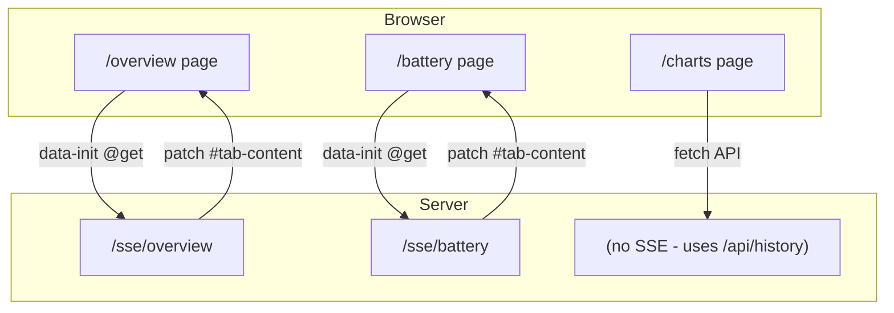
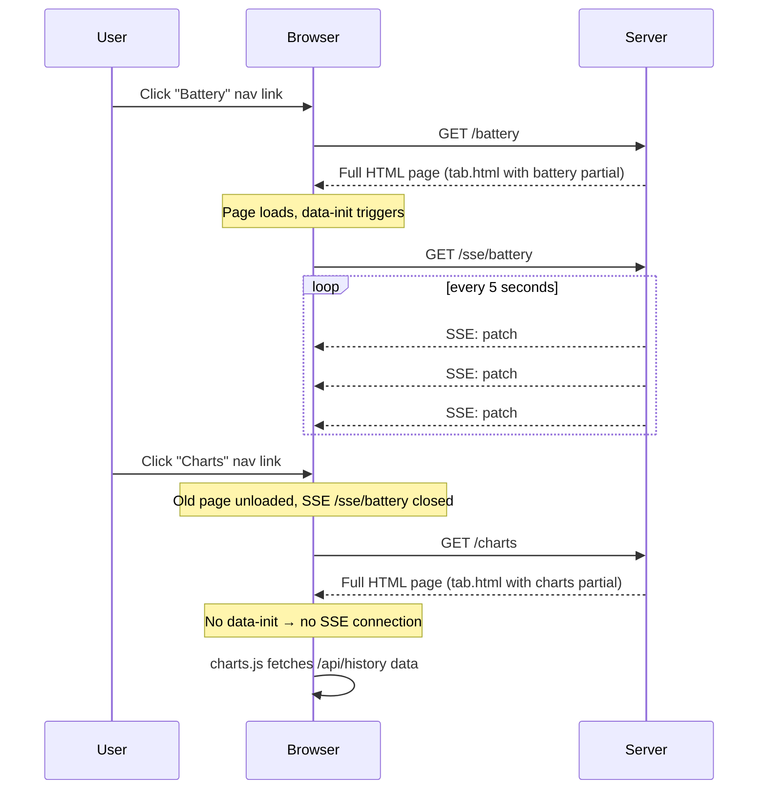

# Per-Tab URL Architecture — Implementation Plan

## Goal

Replace the single-page SPA-style tab switching (`data-show`) with a **multi-page app (MPA)** where each tab is its own URL with its own SSE connection. This follows the Tao of Datastar: server owns presentation, each page is server-rendered, SSE keeps it live with morph patches.

---

## Architecture



### Key Design Decisions

| Decision | Rationale |
|----------|-----------|
| Each tab is a separate URL (`/overview`, `/battery`, etc.) | Bookmarkable, back/forward works, MPA pattern |
| Tab nav uses `<a>` links | Full page navigation, clean SSE lifecycle |
| Each page has its own SSE endpoint (`/sse/<tab>`) | Only renders one tab's content per connection |
| SSE patches `#tab-content`, `#header-meta`, `#alarm-banner` | Targeted morphs, not monolithic |
| Charts tab has no SSE | Uses own `/api/history` fetch + uPlot |
| No `data-show` or `data-signals` for tabs | URL determines active tab, no client-side state |

---

## URL Mapping

| URL | Tab | SSE Endpoint | Template Partial |
|-----|-----|-------------|-----------------|
| `/` | Overview (redirect) | `/sse/overview` | `partials/overview.html` |
| `/overview` | Overview | `/sse/overview` | `partials/overview.html` |
| `/battery` | Battery | `/sse/battery` | `partials/battery.html` |
| `/solar` | Solar | `/sse/solar` | `partials/solar.html` |
| `/load` | Load | `/sse/load` | `partials/load.html` |
| `/generator` | Generator | `/sse/generator` | `partials/generator.html` |
| `/temperatures` | Temperatures | `/sse/temperatures` | `partials/temperatures.html` |
| `/history` | History | `/sse/history` | `partials/history.html` |
| `/charts` | Charts | (none) | `partials/charts.html` |
| `/extra` | Extra | `/sse/extra` | `partials/extra.html` |
| `/alarms` | Alarms | `/sse/alarms` | `partials/alarms.html` |

---

## File Changes

### New Files

| File | Purpose |
|------|---------|
| `src/web/templates/tab.html` | Generic tab page template — extends base.html, includes nav + content slot |

### Modified Files

| File | Change |
|------|--------|
| `src/web/templates/partials/nav.html` | **Extract** tab nav from dashboard.html into a reusable partial |
| `src/web/routes.py` | Replace single `/sse` + `/` with per-tab routes and SSE endpoints |
| `src/web/templates/base.html` | No changes needed |
| `src/web/templates/partials/charts.html` | Remove `data-show` wrapper, add page-level structure |
| `src/web/static/js/charts.js` | Update for multi-page: no `data-show` observer needed, init on page load |
| `src/web/static/css/app.css` | No changes needed |

### Deleted Files

| File | Reason |
|------|--------|
| `src/web/templates/dashboard.html` | Replaced by `tab.html` |
| `src/web/templates/partials/dashboard_content.html` | No longer needed — SSE patches individual elements |

---

## Template Design

### `tab.html` (new)

```html


<div class="app" data-init="@get('/sse/{{ tab }}')">
  <header class="app-header">
    <h1>Selectronics Manager</h1>
    <div id="header-meta" class="header-meta">
      
    </div>
  </header>

  <div id="alarm-banner">
    
  </div>

  

  <div id="tab-content">
    
  </div>
</div>

```

Key points:
- `data-init` connects SSE only for live-data tabs (not Charts)
- `#tab-content` is the SSE target for the active tab's content
- `#header-meta` and `#alarm-banner` are shared SSE targets

### `partials/nav.html` (new, extracted)

```html
<nav class="tab-nav">
  <a class="tab-btn active" href="/overview">Overview</a>
  <a class="tab-btn active" href="/battery">Battery</a>
  <a class="tab-btn active" href="/solar">Solar</a>
  <a class="tab-btn active" href="/load">Load</a>
  <a class="tab-btn active" href="/generator">Generator</a>
  <a class="tab-btn active" href="/temperatures">Temperatures</a>
  <a class="tab-btn active" href="/history">History</a>
  <a class="tab-btn active" href="/charts">Charts</a>
  <a class="tab-btn active" href="/extra">Extra</a>
  <a class="tab-btn active" href="/alarms">Alarms</a>
</nav>
```

Uses `<a>` tags with server-side `active` class based on `tab` template variable.

---

## Routes Design

### `routes.py`

```python
from quart import Blueprint, jsonify, redirect, render_template, request

# Tab registry
TABS = {
    "overview":     {"partial": "partials/overview.html",     "sse": True},
    "battery":      {"partial": "partials/battery.html",      "sse": True},
    "solar":        {"partial": "partials/solar.html",        "sse": True},
    "load":         {"partial": "partials/load.html",         "sse": True},
    "generator":    {"partial": "partials/generator.html",    "sse": True},
    "temperatures": {"partial": "partials/temperatures.html", "sse": True},
    "history":      {"partial": "partials/history.html",      "sse": True},
    "charts":       {"partial": "partials/charts.html",       "sse": False},
    "extra":        {"partial": "partials/extra.html",        "sse": True},
    "alarms":       {"partial": "partials/alarms.html",       "sse": True},
}


# --- Page routes ---

@web_bp.route("/")
async def index():
    return redirect("/overview")


@web_bp.route("/<tab_name>")
async def tab_page(tab_name):
    if tab_name not in TABS:
        return "Not found", 404
    snapshot = view_model.snapshot
    return await render_template("tab.html", tab=tab_name, snapshot=snapshot)


# --- SSE endpoints (one per live-data tab) ---

async def _sse_for_tab(tab_name: str):
    """Generic SSE generator for a single tab."""
    while True:
        snapshot = view_model.snapshot

        # Shared: header + alarm banner
        yield ServerSentEventGenerator.patch_elements(
            await render_template("partials/header.html", snapshot=snapshot),
            selector="#header-meta",
            mode=consts.ElementPatchMode.INNER,
        )
        yield ServerSentEventGenerator.patch_elements(
            await render_template("partials/alarm_banner.html", snapshot=snapshot),
            selector="#alarm-banner",
            mode=consts.ElementPatchMode.INNER,
        )

        # Tab content
        yield ServerSentEventGenerator.patch_elements(
            await render_template(TABS[tab_name]["partial"], snapshot=snapshot),
            selector="#tab-content",
            mode=consts.ElementPatchMode.INNER,
        )

        await asyncio.sleep(refresh_seconds())


@web_bp.route("/sse/overview")
@datastar_response
async def sse_overview():
    return _sse_for_tab("overview")


# ... one route per tab (or use a dynamic route)
```

### Alternative: Dynamic SSE route

```python
@web_bp.route("/sse/<tab_name>")
@datastar_response
async def sse_tab(tab_name):
    if tab_name not in TABS or not TABS[tab_name]["sse"]:
        return "Not found", 404
    return _sse_for_tab(tab_name)
```

This is cleaner — one endpoint handler for all tabs.

---

## Charts Tab Special Handling

The Charts tab (`/charts`) does NOT connect SSE (`data-init` is omitted in `tab.html`). Instead:

1. Page loads with server-rendered initial content
2. [`charts.js`](src/web/static/js/charts.js) detects it's on the charts page (checks for `.chart-area` elements)
3. Fetches data from `/api/history/<var>?range=` and renders uPlot charts
4. Auto-refreshes every 60 seconds via `setInterval`

### Changes to `charts.js`

Remove the Datastar `data-show` observer logic. Replace with simple page-load detection:

```javascript
function initCharts() {
    const chartAreas = document.querySelectorAll('.chart-area');
    if (chartAreas.length === 0) return; // Not on charts page

    // Range buttons
    document.querySelectorAll('.chart-range-btn').forEach(btn => {
        btn.addEventListener('click', () => setRange(btn.dataset.range));
    });

    // Initial render
    renderAllCharts();

    // Auto-refresh
    startRefresh();
}
```

---

## CSS Changes

Tab buttons change from `<button>` to `<a>`. Need to style `<a>` elements the same:

```css
.tab-btn {
  /* existing styles */
  text-decoration: none;
  display: inline-block;
}
```

---

## SSE Lifecycle



Clean lifecycle — no connection leaks, no zombie SSE streams.

---

## Implementation Order

1. **Extract `partials/nav.html`** from dashboard.html tab navigation
2. **Create `tab.html`** — generic tab page template extending base.html
3. **Rewrite `routes.py`** — per-tab page routes + per-tab SSE endpoint (with dynamic route)
4. **Delete `dashboard.html`** and `dashboard_content.html`
5. **Update `charts.html`** — remove Datastar data-show wrapper, add page structure
6. **Update `charts.js`** — simplify init for multi-page (no observer needed)
7. **Update CSS** — ensure `<a>` tab buttons style correctly
8. **Update `.gitignore`** — remove stale DB file reference if needed
9. **Delete old `selpi-history.db`** to start fresh with UTC timestamps
