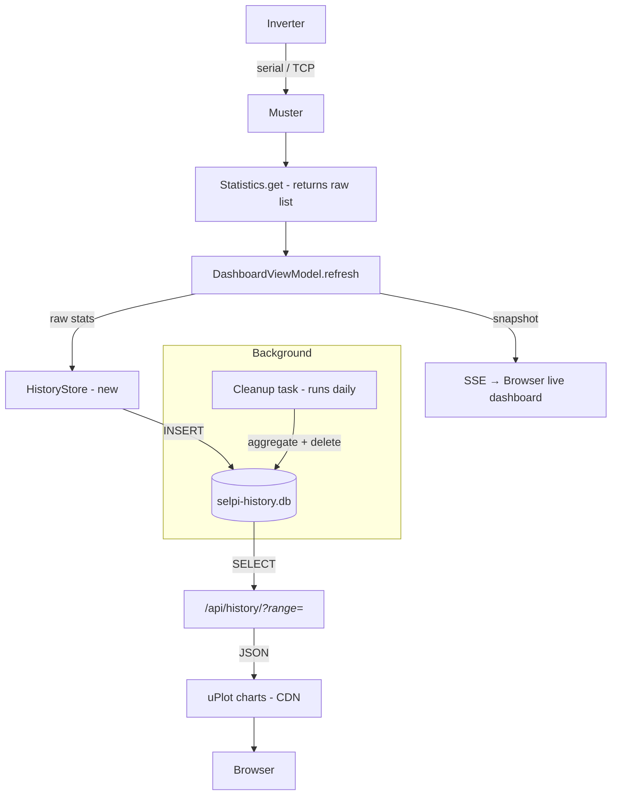

# SQLite History Store — Implementation Plan

## Goal

Add persistent time-series storage to Selpi using **SQLite** so that inverter data can be graphed over hours, days, weeks, and months. No new Python dependencies — uses stdlib `sqlite3`.

---

## Architecture



---

## 1. New Module: `src/history.py`

### Responsibilities

- Initialize the SQLite database and tables on first use
- Record each successful poll as a row per tracked metric
- Query historical data by variable name and time range
- Downsample: aggregate raw → hourly → daily
- Prune old raw and hourly data

### Schema

```sql
-- Raw readings: one row per variable per 5-second poll
CREATE TABLE IF NOT EXISTS readings (
    id INTEGER PRIMARY KEY AUTOINCREMENT,
    ts TEXT NOT NULL DEFAULT (strftime('%Y-%m-%dT%H:%M:%S', 'now', 'localtime')),
    name TEXT NOT NULL,
    value REAL,
    units TEXT
);
CREATE INDEX IF NOT EXISTS idx_readings_name_ts ON readings(name, ts);

-- Hourly aggregates: one row per variable per hour
CREATE TABLE IF NOT EXISTS readings_hourly (
    id INTEGER PRIMARY KEY AUTOINCREMENT,
    ts TEXT NOT NULL,          -- hour boundary e.g. 2026-08-12T14:00:00
    name TEXT NOT NULL,
    avg_value REAL,
    min_value REAL,
    max_value REAL,
    samples INTEGER
);
CREATE INDEX IF NOT EXISTS idx_hourly_name_ts ON readings_hourly(name, ts);

-- Daily aggregates: one row per variable per day
CREATE TABLE IF NOT EXISTS readings_daily (
    id INTEGER PRIMARY KEY AUTOINCREMENT,
    ts TEXT NOT NULL,          -- day boundary e.g. 2026-08-12T00:00:00
    name TEXT NOT NULL,
    avg_value REAL,
    min_value REAL,
    max_value REAL,
    samples INTEGER
);
CREATE INDEX IF NOT EXISTS idx_daily_name_ts ON readings_daily(name, ts);
```

### Class Design

```python
class HistoryStore:
    def __init__(self, db_path: str = "selpi-history.db"):
        """Open or create the database. Runs migrations."""

    def record(self, raw_stats: list[dict]) -> None:
        """Insert one row per tracked metric from a Statistics.get() result.
        Only persists the TRACKED_METRICS subset."""

    def query(self, variable_name: str, range: str = "24h") -> list[dict]:
        """Return [{ts, value, avg, min, max}, ...] for a variable.
        Selects the appropriate table tier:
          - 1h, 6h, 24h  → raw readings
          - 7d, 30d       → readings_hourly
          - 1y            → readings_daily
        """

    def aggregate_hourly(self) -> None:
        """Aggregate raw readings older than 1 hour into readings_hourly.
        Called by the cleanup task."""

    def aggregate_daily(self) -> None:
        """Aggregate hourly readings older than 1 day into readings_daily.
        Called by the cleanup task."""

    def prune(self, raw_days: int = 7, hourly_days: int = 90) -> None:
        """Delete raw data older than raw_days, hourly older than hourly_days.
        Called by the cleanup task."""

    def close(self) -> None:
        """Close the database connection."""
```

### Tracked Metrics

Only persist the metrics useful for graphing. The full list from [`Statistics`](src/statistics.py:19) includes firmware info, serial numbers, and digital I/O states that don't benefit from time-series storage.

```python
TRACKED_METRICS = {
    # Power flows
    "CombinedKacoAcPowerHiRes",  # Solar AC Power (W)
    "LoadAcPower",               # Load AC Power (W)
    "DCBatteryPower",            # Battery Power (W)
    "ACGeneratorPower",          # Generator Power (W)
    "Shunt1Power",               # Shunt 1 Power (W)
    "Shunt2Power",               # Shunt 2 Power (W)
    # Battery
    "BatteryVolts",              # Battery Voltage (V)
    "BattSocPercent",            # State of Charge (%)
    "DCBatteryCurrent",          # Battery Current (A)
    "BatteryTemperature",        # Battery Temp (°C)
    # Energy today
    "BattOutToday",              # Battery Out Today (Wh)
    "BattInToday",               # Battery In Today (Wh)
    "LoadAccumulatedToday",      # Load Today (Wh)
    "ACInputToday",              # AC Input Today (Wh)
    # Solar
    "PercentageSolarOutput",     # Solar Output (%)
    # Temperatures
    "Heatsink1Temp",
    "Heatsink2Temp",
    "ControlBoardTemp",
    "InletTemp",
    "TransformerTemp",
    # Fan
    "FanSpeed",
    # Charge state (store as numeric: 0/1)
    "absorb",
    "bulk",
    "float",
    # Generator
    "GeneratorStatus",
    # Float hours
    "FloatHours",
}
```

At 5-second intervals with ~25 tracked metrics: **~430K rows/day** raw. After 7-day raw retention and hourly aggregation, the database stays under **500MB** on disk.

### SQLite Configuration

```python
# Use WAL mode for concurrent read/write safety
conn.execute("PRAGMA journal_mode=WAL")
# Reduce fsync overhead (acceptable for non-critical telemetry)
conn.execute("PRAGMA synchronous=NORMAL")
# Use local time for all timestamps
```

---

## 2. Integration: `src/web/viewmodel.py`

### Change

Add `HistoryStore` as a dependency of [`DashboardViewModel`](src/web/viewmodel.py:10). After a successful [`Statistics.get()`](src/statistics.py:311) call, pass the raw stats to `HistoryStore.record()`.

```python
class DashboardViewModel:
    def __init__(self) -> None:
        self.__statistics = Statistics()
        self.__history = HistoryStore()       # NEW
        self.__snapshot = { ... }

    def refresh(self) -> dict[str, Any]:
        try:
            raw = self.__statistics.get()
            self.__snapshot = build_view_model(raw)
            self.__history.record(raw)        # NEW: persist on success
            self.__error = None
        except Exception as exc:
            ...
        return self.__snapshot
```

Since [`refresh()`](src/web/viewmodel.py:28) is called from [`refresh_async()`](src/web/viewmodel.py:39) via `asyncio.to_thread()`, the synchronous `sqlite3` writes will not block the Quart event loop.

---

## 3. New API Endpoint: `src/web/routes.py`

### Route

```
GET /api/history/<variable_name>?range=24h
```

| Parameter | Values | Default | Table Used |
|-----------|--------|---------|------------|
| `range` | `1h`, `6h`, `24h`, `7d`, `30d`, `1y` | `24h` | raw / hourly / daily |

### Response Format

```json
{
  "variable": "BattSocPercent",
  "range": "24h",
  "points": [
    {"ts": "2026-08-12T06:00:00", "value": 85.0},
    {"ts": "2026-08-12T06:00:05", "value": 84.8}
  ]
}
```

For hourly/daily tiers, each point includes aggregation:

```json
{
  "variable": "BattSocPercent",
  "range": "7d",
  "points": [
    {"ts": "2026-08-11T14:00:00", "avg": 72.5, "min": 45.0, "max": 95.0, "samples": 720}
  ]
}
```

### Additional Endpoint: Available Variables

```
GET /api/history/variables
```

Returns the list of tracked metric names and their descriptions for the chart picker UI.

### Implementation Notes

- Use [`asyncio.to_thread()`](src/web/viewmodel.py:39) to call the synchronous SQLite query from the async handler
- Add the `history_store` instance to the blueprint or import a module-level singleton

---

## 4. Background Cleanup Task

### Approach

Run a daily cleanup inside the Quart app startup using `asyncio.create_task()`. This avoids needing a separate cron job or scheduler.

### Location

Add to [`src/commands/http.py`](src/commands/commands/http.py) or [`src/web/app.py`](src/web/app.py) using Quart's `before_serving` hook:

```python
@app.before_serving
async def start_background_tasks():
    app.add_background_task(history_cleanup_loop)

async def history_cleanup_loop():
    while True:
        await asyncio.sleep(86400)  # 24 hours
        await asyncio.to_thread(history_store.aggregate_hourly)
        await asyncio.to_thread(history_store.aggregate_daily)
        await asyncio.to_thread(history_store.prune)
```

### Cleanup Logic

```sql
-- Aggregate raw → hourly (for hours that are complete, i.e. older than 1 hour)
INSERT INTO readings_hourly (ts, name, avg_value, min_value, max_value, samples)
SELECT
    strftime('%Y-%m-%dT%H:00:00', ts) as hour,
    name,
    AVG(value),
    MIN(value),
    MAX(value),
    COUNT(*)
FROM readings
WHERE ts < datetime('now', '-1 hour', 'localtime')
GROUP BY hour, name;

-- Delete aggregated raw data
DELETE FROM readings WHERE ts < datetime('now', '-7 days', 'localtime');

-- Aggregate hourly → daily (for days that are complete)
INSERT INTO readings_daily (ts, name, avg_value, min_value, max_value, samples)
SELECT
    strftime('%Y-%m-%dT00:00:00', ts) as day,
    name,
    AVG(avg_value),
    MIN(min_value),
    MAX(max_value),
    SUM(samples)
FROM readings_hourly
WHERE ts < datetime('now', '-1 day', 'localtime')
GROUP BY day, name;

-- Delete aggregated hourly data
DELETE FROM readings_hourly WHERE ts < datetime('now', '-90 days', 'localtime');
```

---

## 5. Frontend: Charts Tab

### Template: `src/web/templates/partials/charts.html`

Add a new "Charts" tab to [`dashboard.html`](src/web/templates/dashboard.html:16). The tab contains:

- A metric selector (dropdown or clickable pills) for choosing which variable to graph
- A range selector (1h, 6h, 24h, 7d, 30d, 1y)
- One or more `<div>` containers for uPlot charts
- Pre-defined chart groups:

| Chart Group | Metrics |
|-------------|---------|
| **Power** | Solar Power, Load Power, Battery Power, Generator Power |
| **Battery** | Voltage, SOC %, Current |
| **Temperatures** | All temp sensors on one chart |
| **Energy Today** | Batt In, Batt Out, Load, AC Input |

### Charting Library: uPlot

- **Size:** ~30KB gzipped — tiny, Pi-friendly
- **Source:** CDN `https://cdn.jsdelivr.net/npm/uplot@1.6.31/dist/uPlot.iife.min.js`
- **CSS:** `https://cdn.jsdelivr.net/npm/uplot@1.6.31/dist/uPlot.min.css`
- **Why over Chart.js:** 6x smaller, purpose-built for time-series, much faster rendering with large datasets

### JavaScript: `src/web/static/js/charts.js`

```javascript
// On tab activation, fetch data and render chart
async function loadChart(variableName, range) {
    const resp = await fetch(`/api/history/${variableName}?range=${range}`);
    const data = await resp.json();
    // Transform to uPlot format: [[timestamps], [values]]
    // Render into the target <div>
}

// Tab change handler - load charts when "Charts" tab is selected
// Range button handlers
// Auto-refresh charts every 60 seconds while tab is active
```

### Dashboard Integration

Add to [`dashboard.html`](src/web/templates/dashboard.html:16):

```html
<button class="tab-btn" data-class:active="$tab === 'charts'"
        data-on:click="$tab = 'charts'">Charts</button>

<div data-show="$tab === 'charts'" id="tab-charts">
    
</div>
```

### CSS

Add chart container styles to [`app.css`](src/web/static/css/app.css):

```css
.chart-container {
    background: var(--card-bg);
    border-radius: 8px;
    padding: 1rem;
    margin-bottom: 1rem;
}
.chart-controls {
    display: flex;
    gap: 0.5rem;
    margin-bottom: 0.5rem;
}
```

---

## 6. Configuration

### New Environment Variables

Add to [`src/.env.dist`](src/.env.dist):

| Variable | Default | Purpose |
|----------|---------|---------|
| `SELPI_HISTORY_DB_PATH` | `selpi-history.db` | SQLite database file path |
| `SELPI_HISTORY_RAW_DAYS` | `7` | Days to retain raw readings |
| `SELPI_HISTORY_HOURLY_DAYS` | `90` | Days to retain hourly aggregates |

### Docker

Mount a volume for the database in [`docker-compose.yml`](docker-compose.yml):

```yaml
volumes:
  - ./data:/app/data
environment:
  - SELPI_HISTORY_DB_PATH=/app/data/selpi-history.db
```

---

## 7. File Changes Summary

| File | Action | Description |
|------|--------|-------------|
| `src/history.py` | **CREATE** | HistoryStore class — SQLite CRUD, aggregation, pruning |
| `src/web/viewmodel.py` | MODIFY | Add HistoryStore instance, call `record()` on refresh |
| `src/web/routes.py` | MODIFY | Add `/api/history/<var>` and `/api/history/variables` endpoints |
| `src/web/app.py` | MODIFY | Add `before_serving` background cleanup task |
| `src/commands/http.py` | MODIFY | Pass db config to app creation |
| `src/web/templates/dashboard.html` | MODIFY | Add "Charts" tab button and panel |
| `src/web/templates/partials/charts.html` | **CREATE** | Chart tab partial — metric picker, range buttons, chart containers |
| `src/web/static/js/charts.js` | **CREATE** | uPlot initialization, fetch + render, auto-refresh |
| `src/web/static/css/app.css` | MODIFY | Chart container styles |
| `src/.env.dist` | MODIFY | Add history config variables |
| `docker-compose.yml` | MODIFY | Add volume mount for db path |
| `src/tests/test_history.py` | **CREATE** | Unit tests for HistoryStore |

### No Changes To

- [`src/statistics.py`](src/statistics.py) — read-only, no modifications needed
- [`src/memory/`](src/memory/) — protocol layer untouched
- [`SP LINK/`](SP LINK/) — reference only, never modified

---

## 8. Implementation Order

```mermaid
gantt
    title Implementation Sequence
    dateFormat X
    axisFormat %s
    section Storage
        Create history.py with HistoryStore class :a1, 0, 1
        Add unit tests for HistoryStore :a2, after a1, 1
    section Integration
        Wire HistoryStore into viewmodel.py :b1, after a2, 1
        Add /api/history endpoints to routes.py :b2, after a1, 1
    section Background
        Add cleanup task to app.py :c1, after b1, 1
    section Frontend
        Create charts.js with uPlot rendering :d1, after b2, 1
        Create charts.html partial :d2, after d1, 1
        Add Charts tab to dashboard.html :d3, after d2, 1
        Add chart CSS styles :d4, after d3, 1
    section Config
        Update .env.dist and docker-compose.yml :e1, after c1, 1
```



### Steps

1. **Create `src/history.py`** — HistoryStore with schema init, `record()`, `query()`, aggregation, and pruning methods
2. **Create `src/tests/test_history.py`** — Unit tests for recording, querying, aggregation, and pruning
3. **Wire into `src/web/viewmodel.py`** — Add HistoryStore, call `record()` after each successful poll
4. **Add API endpoints to `src/web/routes.py`** — `/api/history/<var>?range=` and `/api/history/variables`
5. **Add background cleanup to `src/web/app.py`** — `before_serving` hook with daily aggregation + pruning
6. **Create `src/web/static/js/charts.js`** — uPlot chart rendering, data fetching, range switching
7. **Create `src/web/templates/partials/charts.html`** — Metric picker, range buttons, chart containers
8. **Add Charts tab to `src/web/templates/dashboard.html`** — Tab button and panel include
9. **Add chart styles to `src/web/static/css/app.css`** — Container, controls, responsive layout
10. **Update config files** — `.env.dist` and `docker-compose.yml` for db path and retention settings

---

## 9. Disk Usage Estimates

| Tier | Retention | Rows | ~Size |
|------|-----------|------|-------|
| Raw | 7 days | ~3M | ~250MB |
| Hourly | 90 days | ~55K | ~5MB |
| Daily | Unlimited 1yr | ~9K | ~1MB |
| **Steady state total** | | | **~256MB** |

With WAL mode, add ~2x for journal files during active writes, so budget ~500MB total.

For an SD card, this is acceptable. If tighter constraints exist, reduce `SELPI_HISTORY_RAW_DAYS` to 3 or 5.

---

## 10. Future Considerations

- **Export:** Add `/api/history/export?format=csv` for data export (CSV download)
- **Multi-variable charts:** Allow overlaying solar power + load power on one chart
- **Alarms timeline:** Store alarm state changes as discrete events for overlay markers on charts
- **Comparison views:** Yesterday vs today, this week vs last week
- **Grafana:** If Grafana is desired later, add a simple JSON datasource plugin that reads from the same SQLite
